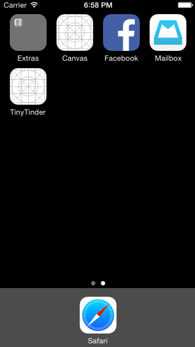

# Facebook Demo

A prototype showing the transition of an image from the feed view to the photo viewer and back.

Time spent: 11 hours spent in total

Completed user stories:

 * [x] Required:
  * Tapping on a photo in the news feed should expand the photo full screen.
  * Tapping the Done button should animate the photo back into its position in the news feed.
  * On scroll of the full screen photo, the background should start to become transparent, revealing the feed.
  * If the user scrolls a large amount and releases, the full screen photo should dismiss.
 

Walkthrough of all user stories:

GIF created with [LiceCap](http://www.cockos.com/licecap/).

